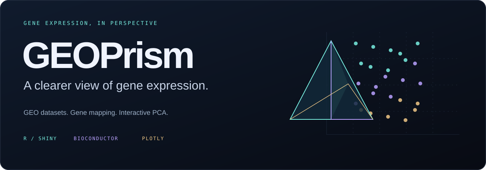

<div align="center">



# GEOPrism · GEO Gene Expression Analysis & Interactive PCA

**A clearer view of gene expression.**

An R Shiny workspace for exploring GEO datasets, mapping probes to genes,<br>
and understanding sample relationships through interactive PCA.


[Website](https://willcolsonrx.github.io/geoprism/) · [Get started](#get-started) · [Explore the workflow](#from-accession-to-insight) · [Methods](#the-science-behind-the-view) · [Publish your copy](.github/PUBLISHING.md)

</div>

---

## See the samples behind the matrix

A gene-expression matrix is only part of the story. GEOPrism brings sample metadata, gene mapping, group assignment, and visual exploration into one connected workspace—so you can inspect what you have before choosing what to do next.

| Explore | Connect | Discover |
| :--- | :--- | :--- |
| Load a GEO Series and inspect its available platforms, samples, and expression values. | Map supported probes to gene symbols and bring selected metadata alongside expression values. | Explore sample relationships with interactive PCA and export reusable tables and figures. |

## From accession to insight

**01 / Load** → **02 / Inspect** → **03 / Map & group** → **04 / Explore PCA** → **05 / Export**

<details>
<summary><strong>Inside the workspace: all eight application tabs</strong></summary>

| Tab | What you can do |
| :--- | :--- |
| Dataset summary | Review the chosen GEO dataset, platform, and sample counts. |
| Sample metadata | Search and inspect the GEO sample annotations. |
| Feature matrix | Preview expression values with features or samples as rows. |
| Probe → gene mapping | Inspect gene-symbol mappings and mapping coverage. |
| Gene matrix | Preview mapped expression values and search gene symbols. |
| Define sample groups | Assign an editable Group label to each selected sample. |
| Combined table | Preview expression values alongside groups and selected metadata. |
| Interactive PCA | Explore principal components, explained variance, and sample coordinates. |

</details>

## A different perspective, one control away

- **Explore in place.** Hover, zoom, pan, select points, and toggle legend groups.
- **Bring your context.** Color points by assigned groups or GEO metadata; optionally map metadata to point shapes.
- **Choose your view.** Select PC axes and adjust point size, opacity, title, and persistent sample labels.
- **Control the calculation.** Use all variable mapped features or the most variable subset, with optional centering and scaling.
- **Take it with you.** Export PCA coordinates, gene matrices, metadata, and SVG / 300-dpi PNG / JPG figures.

> Group and metadata colors help interpret the PCA. They do not enter its calculation. Point selection is a visual interaction; it does not assign groups or remove samples automatically.

## Get started

**You need:** R, an internet connection, and optionally RStudio. A verified R/package compatibility matrix has not yet been established.

1. Clone or download this repository and extract it if necessary.
2. Open `GEOPrism.Rproj` in RStudio, or set your R working directory to the folder containing `app.R`.
3. Run:

```r
# First run: install CRAN and Bioconductor dependencies
source("install_packages.R")

# Launch GEOPrism
shiny::runApp()
```

For later sessions, run `shiny::runApp()` from the same directory.

<details>
<summary><strong>Dependencies at a glance</strong></summary>

| Source | Packages |
| :--- | :--- |
| CRAN | `shiny`, `DT`, `ggplot2`, `plotly`, `svglite`, `BiocManager` |
| Bioconductor | `GEOquery`, `AnnotationDbi`, `hgu133plus2.db`, `hugene10sttranscriptcluster.db` |

`svglite` supports SVG downloads. Bioconductor annotation packages may take longer to install than the UI packages.

</details>

## Your first dataset

The app includes **`GSE9624` as its default accession**. This is a starting value in the interface, not a bundled dataset or a verified benchmark.

1. Click **Load GEO dataset** and choose the available platform / ExpressionSet.
2. Review sample metadata and select the samples to retain.
3. Inspect the probe-to-gene mapping; choose whether to average probes or retain them separately.
4. Assign optional groups in tab 6.
5. Open **Interactive PCA**, choose distinct PC axes, and color samples using relevant metadata.
6. Export the matrix, coordinates, or figures you need.

**Sample minimums:** two for matrix operations; three for PCA, with at least two finite, variable features remaining.

## Know your platform

Built-in gene-symbol annotation is configured for:

| GEO platform | Bioconductor annotation |
| :--- | :--- |
| **GPL570** | `hgu133plus2.db` |
| **GPL6244** | `hugene10sttranscriptcluster.db` |

Other datasets may provide metadata and feature matrices, but **gene-level tables and PCA require a supported mapping**. See `R/helpers.R` to extend platform support. The app reads GEO Series matrices; it does not process raw sequencing reads.

## The science behind the view

**Expression input.** The application uses values from the selected GEO ExpressionSet. It adds no normalization, log transformation, batch correction, or imputation. Check the source study’s preprocessing.

**Probe mapping.** `AnnotationDbi::mapIds()` maps `PROBEID` to `SYMBOL`, choosing the first mapping when multiple symbols are returned. Unmapped probes are excluded from mapped matrices. Multiple probes per symbol can be averaged using an arithmetic mean or retained as distinct rows.

**PCA.** The application optionally excludes samples labeled `Exclude`, removes rows containing non-finite values and zero-variance rows, and selects all remaining features or the most variable subset. It then calls `stats::prcomp()` on the transposed expression matrix.

| Default | Setting |
| :--- | :--- |
| Feature selection | Up to 1,000 most variable mapped features |
| Variance ranking | Before optional scaling |
| Centering | On |
| Unit-variance scaling | Off |
| Remove samples labeled `Exclude` | On, for PCA only |

When probes are kept separately, PCA uses those probe-level rows even where the interface says “genes.” Group and metadata annotations are attached after calculation.

> PCA is exploratory. A distant sample is a reason to inspect its context, not an automatic reason to delete it. GEOPrism does not implement differential expression, enrichment analysis, or machine-learning model training.

## Export with context

| Output | Format | Scope |
| :--- | :--- | :--- |
| Gene expression matrix | CSV | Selected samples; chosen matrix orientation |
| Expression + metadata table | CSV | Selected samples, Group, selected metadata, mapped expression |
| Sample metadata | CSV | **All samples and columns** in the selected ExpressionSet |
| PCA coordinates | CSV | PCA-included samples, coordinates, and plotting metadata |
| PCA figure | SVG / PNG / JPG | 9 × 7 inches; raster exports at 300 dpi |

- The current UI calls the combined table **“ML-ready.”** It is an export for downstream preparation; it does not guarantee modeling readiness.
- The gene-symbol search filters the preview only, not PCA or matrix downloads.
- `Exclude` affects PCA when enabled; other exports retain the selected samples.
- Static figure downloads use the ggplot controls. Browser-only zoom, legend hiding, drawings, and selections are not carried into these exports.


## A home for the project

This repository includes a matching **GitHub Pages landing page and documentation site**, with a functional 3D/2D synthetic PCA explorer. Rotate and zoom the plot, inspect a sample, filter groups, search and sort the table, inspect explained variance, or export the demo as CSV. The browser computes PCA on a deterministic 72 × 36 synthetic matrix; scaling triggers recalculation. This website demonstration does not add 3D plotting to the R app. It introduces the project; the R Shiny app performs the analysis.

To preview locally, open `docs/index.html`, or use the included Node.js server (Node 18 or later, no dependencies):

```sh
npm start
```

Open `http://127.0.0.1:4173`. Run `npm test` to check the demo PCA and projection mathematics. Alternatively, serve the folder with Python:

```sh
python -m http.server 8000 --directory docs
```

Then visit `http://localhost:8000`. See [PUBLISHING.md](.github/PUBLISHING.md) to publish through GitHub Pages and connect an independently hosted Shiny app.


**License:** [Apache License 2.0](LICENSE). Dependencies and GEO datasets retain their respective licenses and terms.

---

<div align="center">

**GEOPrism**<br>
<sub>A clearer view of gene expression.</sub>

</div>
